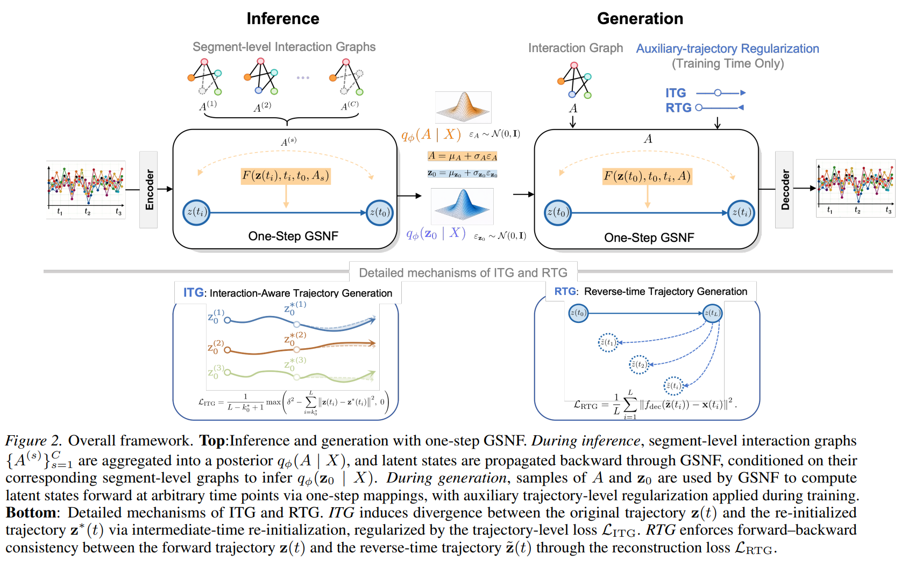

# GSNF

This is a PyTorch implementation of the paper: [One-Step Graph-Structured Neural Flows for Irregular Multivariate Time Series Classification](https://arxiv.org/abs/2605.10179) published in ICML 2026.



## Requirements

The model is implemented using Python 3.10 with the following dependencies:

```text
pytorch==1.12.1
cudatoolkit==11.3
numpy
scikit-learn
scipy
```

## Environment

```bash
conda env create -f environment.yml
conda activate gsnf
```

## Dataset Acquisition

The PhysioNet 2012 Challenge dataset is available from the official [PhysioNet Challenge 2012 page](https://physionet.org/content/challenge-2012/). The P12 command uses this dataset after it has been prepared under the selected data root.

The PhysioNet 2019 Challenge dataset is available from the official [PhysioNet Challenge 2019 page](https://physionet.org/content/challenge-2019/). The P19 command uses this dataset after it has been prepared under the selected data root.

The eICU Collaborative Research Database is available from the official [PhysioNet eICU-CRD page](https://physionet.org/content/eicu-crd/). Access requires a PhysioNet account, completion of the required training, and acceptance of the applicable data use agreement. After access is approved, download the database and prepare it under the data root used by the eICU command.

MIMIC-IV is available from the official [PhysioNet MIMIC-IV page](https://physionet.org/content/mimiciv/). Access requires a PhysioNet account, completion of the required training, and acceptance of the applicable data use agreement. After access is approved, download the database and prepare it under the data root used by the MIMIC4 command.

## Training

### PhysioNet12

```bash
python train.py \
  --data-root /path/to/PhysioNet12 \
  --device cuda \
  --seed 0
```

### P12

```bash
python train.py \
  --data-root /path/to/P12 \
  --device cuda \
  --seed 0
```

### P19

```bash
python train.py \
  --data-root /path/to/P19 \
  --device cuda \
  --seed 0
```

### eICU

```bash
python train.py \
  --data-root /path/to/eICU \
  --device cuda \
  --seed 0
```

### MIMIC4

```bash
python train.py \
  --data-root /path/to/MIMIC4 \
  --device cuda \
  --seed 0
```
